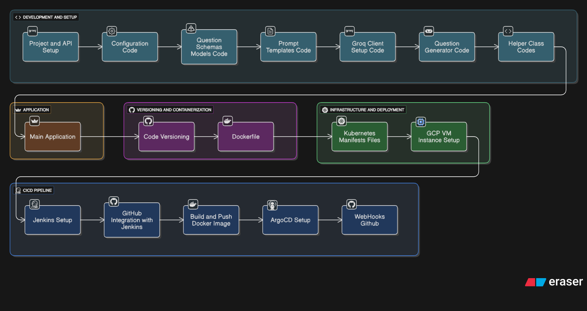

# 🎓 QuizCrafter AI

<div align="center">


**An intelligent AI-powered quiz generation platform that creates personalized quizzes using advanced language models.**

[Demo](#-demo) • [Features](#-features) • [Installation](#-installation) • [Usage](#-usage) • [Architecture](#-architecture) • [Contributing](#-contributing)

</div>

---

## 🎯 Workflow




## 🚀 Demo


*Experience the power of AI-driven quiz generation with our intuitive interface!*


## ✨ Features

### 🧠 **Intelligent Question Generation**
- **Multiple Question Types**: MCQ, True/False, Fill-in-the-Blanks
- **Customizable Difficulty**: Easy, Medium, Hard levels
- **Topic Flexibility**: Generate quizzes on any subject
- **AI-Powered**: Uses Groq LLM for high-quality question generation

### 🎯 **Interactive Quiz Experience**
- **Modern UI**: Clean, responsive Streamlit interface
- **Real-time Feedback**: Instant scoring and explanations
- **Progress Tracking**: Visual progress indicators and statistics
- **Results Analysis**: Detailed breakdown with explanations

### 📊 **Advanced Analytics**
- **Performance Metrics**: Score visualization with charts
- **Detailed Results**: Question-by-question analysis
- **Export Functionality**: Download results as CSV
- **Session Management**: Seamless quiz state handling

### 🛠 **Production Ready**
- **Docker Support**: Containerized deployment
- **Kubernetes Ready**: K8s manifests included
- **CI/CD Pipeline**: Jenkins integration
- **Scalable Architecture**: Modular design with proper error handling

## 🏗 Architecture

```
QuizCrafter AI/
├── 📱 Frontend (Streamlit)
│   ├── app.py (Main application)
│   └── static/ (CSS styling)
├── 🧠 Core Logic
│   ├── src/generator/ (Question generation)
│   ├── src/llm/ (Groq integration)
│   ├── src/models/ (Pydantic schemas)
│   └── src/prompts/ (LLM templates)
├── ⚙️ Configuration
│   ├── src/config/ (Settings)
│   └── src/common/ (Logging & exceptions)
├── 🐳 Deployment
│   ├── Dockerfile
│   ├── manifests/ (Kubernetes)
│   └── Jenkinsfile (CI/CD)
└── 📊 Data
    ├── results/ (Quiz results)
    └── logs/ (Application logs)
```

## 🛠 Installation

### Prerequisites
- Python 3.10+
- Groq API Key ([Get one here](https://console.groq.com/))

### Local Setup

1. **Clone the repository**
   ```bash
   git clone https://github.com/yourusername/QuizCrafter-AI.git
   cd QuizCrafter-AI
   ```

2. **Create virtual environment**
   ```bash
   python -m venv venv
   source venv/bin/activate  # On Windows: venv\Scripts\activate
   ```

3. **Install dependencies**
   ```bash
   pip install -r requirements.txt
   # Or use setup.py
   pip install -e .
   ```

4. **Configure environment**
   ```bash
   # Create .env file
   echo "GROQ_API_KEY=your_groq_api_key_here" > .env
   ```

5. **Run the application**
   ```bash
   streamlit run app.py
   ```

Visit `http://localhost:8501` to access the application!

### 🐳 Docker Deployment

```bash
# Build the image
docker build -t quizcrafter-ai .

# Run the container
docker run -p 8501:8501 -e GROQ_API_KEY=your_api_key quizcrafter-ai
```

### ☸️ Kubernetes Deployment

```bash
# Apply the manifests
kubectl apply -f manifests/

# Create the secret for Groq API key
kubectl create secret generic groq-api-secret --from-literal=GROQ_API_KEY=your_api_key
```

### Customization

Edit `src/config/settings.py` to modify:
- API retry settings
- Question generation parameters
- Logging levels

## 📊 MLOps Features

### Monitoring & Logging
- Comprehensive logging with structured formats
- Session tracking and user analytics
- Error monitoring and alerting

### CI/CD Pipeline
- Automated testing and deployment
- Docker image building and pushing
- Kubernetes deployment automation

### Data Management
- Quiz results storage and retrieval
- Performance metrics tracking
- Data export capabilities


## 📝 License

This project is licensed under the MIT License - see the [LICENSE](LICENSE) file for details.

## 👨‍💻 Author

**Atharva Hatekar**
- GitHub: [@atharvahatekar](https://github.com/atharvahatekar)
- LinkedIn: [Atharva Hatekar](https://linkedin.com/in/atharvahatekar)


<div align="center">

**⭐ Star this repository if you found it helpful!**

Made with ❤️ by [Atharva Hatekar](https://github.com/atharvahatekar)

</div>
